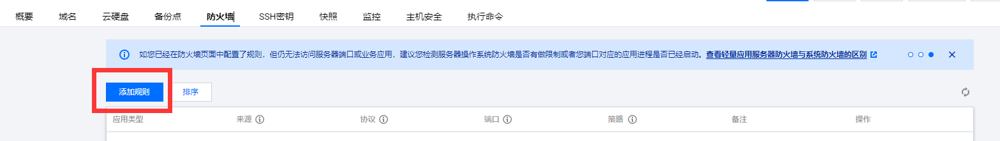

# 🖥 故障排除和解决方法


**Good to know:** depending on the product you're building, it can be useful to explicitly document use cases. Got a product that can be used by a bunch of people in different ways? Maybe consider splitting it out!


## 服务器部署问题

### 服务端启动无法连接服务器

#### 服务器防火墙

查看防火墙状态：

```bash
sudo iptables -L -n
```

关闭防火墙：

```bash
sudo ufw disable
```

#### 云服务器开启25565端口

以腾讯云为例：

选择防火墙

<figure><figcaption></figcaption></figure>

选择 添加规则

<figure><figcaption></figcaption></figure>

添加25565端口

<figure><figcaption></figcaption></figure>

Cras mattis consectetur purus sit amet fermentum. Praesent commodo cursus magna, vel scelerisque nisl consectetur et.



Sed posuere consectetur est at lobortis. Integer posuere erat a ante venenatis dapibus posuere velit aliquet. Aenean lacinia bibendum nulla sed consectetur. Maecenas sed diam eget risus varius blandit sit amet non magna.

```
string | ComponentClass<any, any> | FunctionComponent<any>
```



Maecenas faucibus mollis interdum. Donec id elit non mi porta gravida at eget metus. Donec ullamcorper nulla non metus auctor fringilla. Donec sed odio dui. Donec ullamcorper nulla non metus auctor fringilla.


